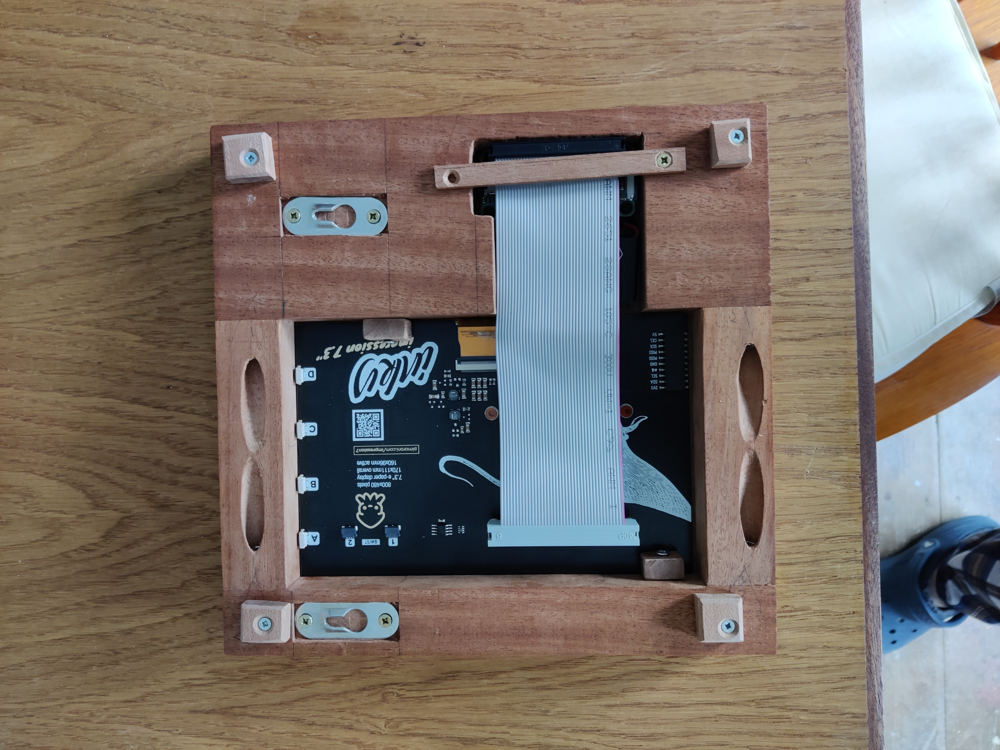
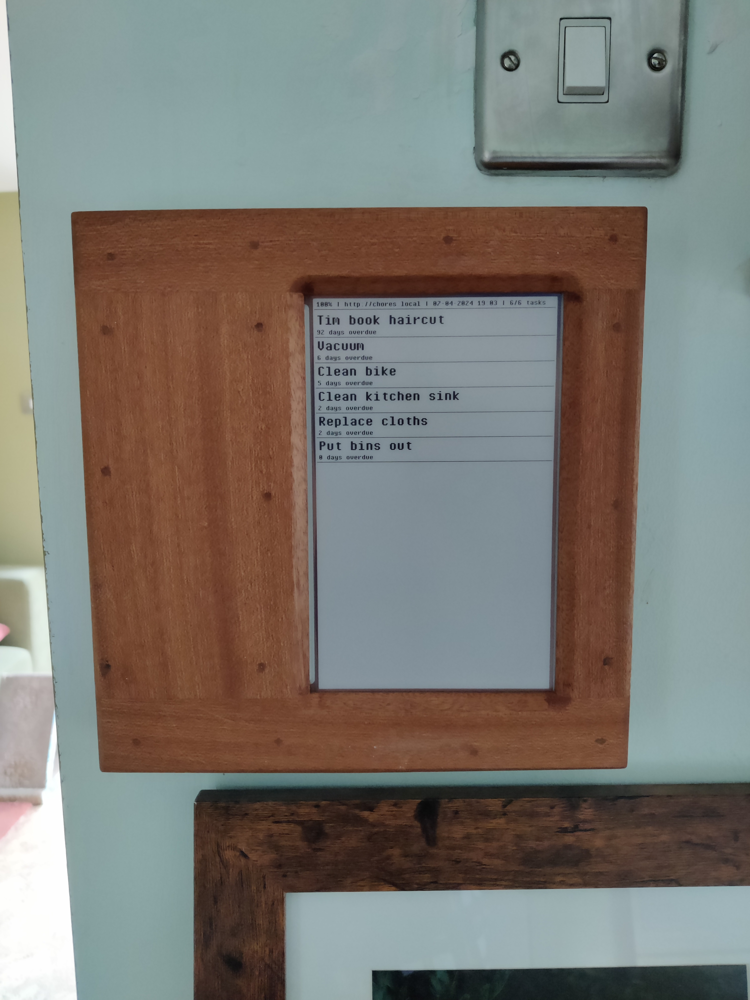

# chores-eink-display

Displays overdue chores (provided by the [chores app API](https://github.com/sizlo/chores)) on an eink display connected to a Raspberry Pi. The Raspberry Pi is connected to a battery pack which automatically boots up the device once per day. Once the chores have been rendered to the display the device powers down to conserve battery.

If the PiSugar is plugged in to power the device will not power down after running. This allows you to ssh into the device.

I am running this with
- A [Raspberry Pi Zero W](https://www.raspberrypi.com/products/raspberry-pi-zero-w/)
- An [Inky Impression 4"](https://shop.pimoroni.com/products/inky-impression-7-3)
- A [PiSugar 3](https://github.com/PiSugar/PiSugar)

## Resources

- [Python library provided by pimoroni/inky](https://github.com/pimoroni/inky)
- PiSugar documentation
  - [Github repo](https://github.com/PiSugar/PiSugar)
  - [Github wiki](https://github.com/PiSugar/PiSugar/wiki)
  - [Wiki page specific for PiSugar 3](https://github.com/PiSugar/PiSugar/wiki/PiSugar-3-Series)
  - [List of commands to interact with PiSugar from Raspberry Pi](https://github.com/PiSugar/PiSugar/wiki/PiSugar-Power-Manager-(Software)#commands)

Note: The power button for the PiSugar is the one closest to the magnet. Click it once and then hold it to power on or off the device. This information was not readily available in thr documentation.

## Running

### Running on a desktop for dev/testing

This is set up to run via docker as the inky library cannot be installed on macos ([see here](https://github.com/pimoroni/inky/issues/185)). The inky library does provide a display simulation using tkinter, but I couldn't be bothered setting that up to work through docker, so the program writes an image file to disk whenever it would refresh the eink display.

`docker compose up --build`

The file `resources/eink-screen.png` will be written to every time the eink display would refresh. If you have this image file selected in finder the preview will live update.

Set the `CHORES_API_URL` to the url you want to use, if this is set to a file path the program will read a mock json response from that file.

### Running on a Raspberry Pi

#### Set up the Raspberry Pi and software

- Install OS on Raspberry Pi with [Raspberry Pi Imager](https://www.raspberrypi.com/software/)
    - I used Raspberry Pi OS Lite - This is a headless OS
    - Configure Raspberry Pi Imager to apply OS customization settings
        - Enable ssh with password authentication
        - Set hostname to `chores-display`
        - Create a username and password (note to author: these are stored in Bitwarden if you've forgotten them)
        - Configure Wi-Fi network
- Boot up Raspberry Pi and ssh in: `ssh <user>@chores-display.local`
- Install software
  - pip: `sudo apt install python3-pip`
  - inky: `pip3 install inky[rpi,example-depends]`
  - git: `sudo apt install git`
  - pisugar software: `curl http://cdn.pisugar.com/release/pisugar-power-manager.sh | sudo bash`
    - You will be asked to configure a username and password for the web-ui, I chose the same details as the Raspberry Pi user
- Enable I2C and SPI in the `sudo raspi-config` menu
- Clone this repo (use https so no credentials are needed, you will not be pushing to the repo from the device)
- Create a `startup.sh` script which sets up the config and runs the program
  ```
  #!/bin/bash
  
  export RESOURCES_PATH=/path/to/chores-eink-display/resources
  export CHORES_API_URL=http://pi.local/chores # Replace this with the url you are running the chores-api on 
  export REFRESH_HOUR=5 # This tells the device to run every day at 5am
  export DISPLAY_MODE=eink-screen
  
  python3 /path/to/chores-eink-display/chores-eink-display.py --type impressions7
  ```
- Configure cron to run the `startup.sh` script at startup
  - Launch the cron editor `crontab -e`, add the following line:
    ```
    @reboot /path/to/startup.sh
    ```
- Power off the device

#### Assemble the hardware

I bought a Raspberry Pi Zero WH (with headers pre-soldered on) to make assembly easier.

Connect the Raspberry Pi to the PiSugar. Simply screw the two together. The brass coloured spring pins on the PiSugar should contact the GPIO pins on the Raspberry Pi.


Connect the Raspberry Pi GPIO pins to the display using a [ribbon cable](https://thepihut.com/products/40-pin-gpio-male-to-female-ribbon-cable-150mm-gertboard). I also used a [GPIO riser](https://thepihut.com/products/gpio-riser-header-for-raspberry-pi) because the plastic shroud on the ribbon cable prevented the pins going deep enough into the display.


Mount the device into a frame.



Display somewhere prominent so you always know what chores need doing


